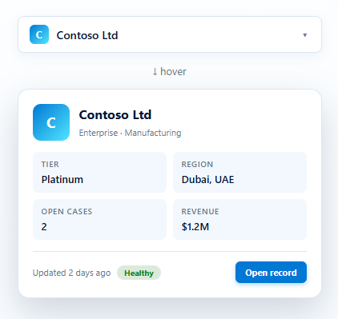

# SmartLookup

> Rich hover-preview cards for Dataverse lookup fields in model-driven Power Apps and Dynamics 365. Drop on any Lookup column — the chip stays familiar, but hovering reveals the related record's primary fields, image and a one-click "Open record" button. Linear / Notion-grade lookup UX with zero config.

[](https://github.com/syedbilal1997/SmartLookup-PCF/releases)
[](LICENSE)
[](https://learn.microsoft.com/power-apps/developer/component-framework)



Perfect for any model-driven form that uses lookups to **Accounts, Contacts, Leads, Opportunities, Users, Teams, or custom tables** — i.e. every model-driven form ever.

- 🪄 **Drop-and-go.** Bind one Lookup column. That's the only required step.
- 📝 **Reads your Quick View Forms.** Edit a field on the entity's standard Quick View Form in Power Apps → SmartLookup picks it up on next refresh. No per-PCF setup.
- 🎯 **Smart fallbacks.** No QVF? Built-in sensible defaults for Account, Contact, Lead, Opportunity, User, Team — and a metadata-driven fallback for custom tables.
- 🎨 **Auto image / initials.** Uses the record's entity image if it has one, otherwise renders a coloured initials avatar.
- ⚡ **Tiny.** Pure TypeScript + CSS. No framework. No external services. ~14 KB managed solution.
- ♿ **Accessible.** Keyboard focus / Enter / Esc, ARIA-labelled, respects `prefers-reduced-motion`.

---

## The "Quick View Form" superpower

This is the feature that makes SmartLookup actually useful in real organisations:

> **You don't configure SmartLookup. You edit the Quick View Form like you always have.**

Microsoft already has a form type designed for "show a few fields about this record in a preview context" — the **Quick View Form**. Most enterprise admins know how to edit one. SmartLookup reads that form and renders exactly those fields, in the order the admin arranged them.

Drag a field onto the QVF → it appears in the SmartLookup card on next refresh. Re-order the fields on the QVF → SmartLookup re-orders. Remove a field → it disappears. **No PCF redeploy. No JSON config. No per-form setup.**

That's the whole trick.

---

## Field resolution cascade

When you hover a lookup, SmartLookup resolves the field list in this order:

```
1. previewFields override  →  highest priority — power-user escape hatch
2. Quick View Form         →  RECOMMENDED — drag/drop in Power Apps designer
3. Smart defaults          →  hardcoded for Account, Contact, Lead, etc.
4. Generic candidates      →  final fallback for unknown custom tables
```

You can see which path was taken in the browser DevTools console:
```
[SmartLookup] field source for systemuser: qvf (jobtitle,businessunitid,internalemailaddress)
```

The four possible sources: `override` · `qvf` · `defaults` · `generic`.

---

## Quick install (3 minutes)

1. Download the latest `SmartLookup_X.Y.Z_managed.zip` from the **[Releases](../../releases/latest)** page.
2. In Power Apps maker portal → **Solutions → Import** → upload the zip → publish.
3. Open any model-driven form, edit the form, pick a **Lookup column**, choose **Components → Get more components → Smart Lookup → Add**.

That's it. Save and publish — the chip + preview card go live on next form load.

To customise which fields appear, edit the related entity's **Quick View Form** (Power Apps → table → Forms → Quick View Form). SmartLookup picks up your changes on the next form refresh.

---

## Properties

| Property | Type | Required | What it does |
|---|---|---|---|
| **Lookup** | Lookup *(bound)* | ✅ | The lookup column to enhance. |
| **Use Quick View Form** | Enum | — | `On` (default, recommended) / `Off`. When On, reads the related entity's QVF for the field list. |
| **Quick View Form name** | Text | — | Optional. If the entity has multiple QVFs, type the exact name to use. Empty = auto-pick "Information" or first active. |
| **Preview fields (override)** | Text | — | Comma-separated attribute logical names. Highest priority — overrides QVF and smart defaults. Max 6. |
| **Accent colour (hex)** | Text | — | Override the default Microsoft blue (e.g. `#107c10`). |
| **Card position** | Enum | — | `Auto` / `Below` / `Above` / `Right`. Default: Auto picks side with most space. |
| **Show "Open record" button** | Enum | — | `On` / `Off`. Default: On. |
| **Hover delay (ms)** | Whole number | — | Delay before the card appears on hover. Default 250. Set 0 for instant. |

### Smart defaults per entity (when no QVF exists)

| Entity | Default preview fields |
|---|---|
| `account` | Industry · Phone · City · Revenue |
| `contact` | Job title · Company · Email · Phone |
| `lead` | Subject · Company · Source · Email |
| `opportunity` | Est. value · Close date · Stage |
| `systemuser` | Job title · Business unit · Phone · Email |
| `team` | Business unit · Team type · Administrator · Description |
| *anything else* | First 4 from: description, phone, city, country, email, website, status |

---

## How field filtering works

After SmartLookup gets the field list (from QVF, override, or defaults), it runs 5 filter stages so the card always looks clean:

| Stage | What it does |
|---|---|
| 1 | Extract `<control datafieldname>` entries from QVF XML (skips sub-grids, sub-QVFs) |
| 2 | Drop system / audit noise (`createdon`, `modifiedon`, `statecode`, `versionnumber`, etc.) |
| 3 | Drop duplicates |
| 4 | Cap at 6 fields |
| 5 | Drop fields that are null / empty / nested-object on the actual record |

Empty cells just disappear — the card stays sparse and scannable, never shows `Email: —`. Audit fields like `modifiedon` are filtered from the grid but still power the *"Updated 2h ago"* line in the footer.

---

## Building from source

The project follows the *controlsRoot* PCF layout (pcfproj at the outer level, control source in an inner folder of the same name).

```powershell
# One-off install
npm install

# Iterate in the test harness — opens a browser tab
npm start watch

# Produce a versioned managed-solution release zip
.\scripts\build-release.ps1 -Version "1.1.0"
# → release/SmartLookup_1.1.0_managed.zip
```

The release script invokes `dotnet build --configuration Release` on the solution wrapper under `Solution/` and copies the resulting zip into `release/` with a clean filename.

## Repo layout

```
SmartLookup/                         ← repo root
├── SmartLookup.pcfproj              ← MSBuild project
├── pcfconfig.json                   ← controlsRoot: ./SmartLookup
├── package.json, tsconfig, eslint
├── SmartLookup/                     ← control source
│   ├── ControlManifest.Input.xml
│   ├── index.ts
│   ├── css/SmartLookup.css
│   └── strings/SmartLookup.1033.resx
├── Solution/                        ← Dataverse solution wrapper
├── scripts/build-release.ps1        ← one-click versioned build
├── release/                         ← built zips (gitignored)
└── docs/screenshots/                ← README assets
```

---

## Contributing

Issues, ideas, and PRs are welcome. See [`CONTRIBUTING.md`](CONTRIBUTING.md) for the build setup and contribution flow.

If you build something cool with this — a custom configuration, a creative use case, a smart preview-field combination — I'd genuinely love to see it. Open an issue with a screenshot, or tag me on LinkedIn.

## Author

**Syed Bilal Ahmed** — Microsoft Dynamics 365 / Power Platform developer based in Dubai.
I write about PCF and Power Platform development at [syedbilal365.hashnode.dev](https://syedbilal365.hashnode.dev).

- 🌐 Blog — [Bilal on Power Platform](https://syedbilal365.hashnode.dev)
- 💼 LinkedIn — [linkedin.com/in/sybilal](https://www.linkedin.com/in/sybilal/)
- 🐙 GitHub — [@syedbilal1997](https://github.com/syedbilal1997)
- 🌐 Portfolio — [syedbilal1997.github.io](https://syedbilal1997.github.io)

If SmartLookup saves you an afternoon, ⭐ the repo — it's the easiest way to say thanks and helps other Power Platform devs discover it.

## License

[MIT](LICENSE) © 2026 Syed Bilal Ahmed
